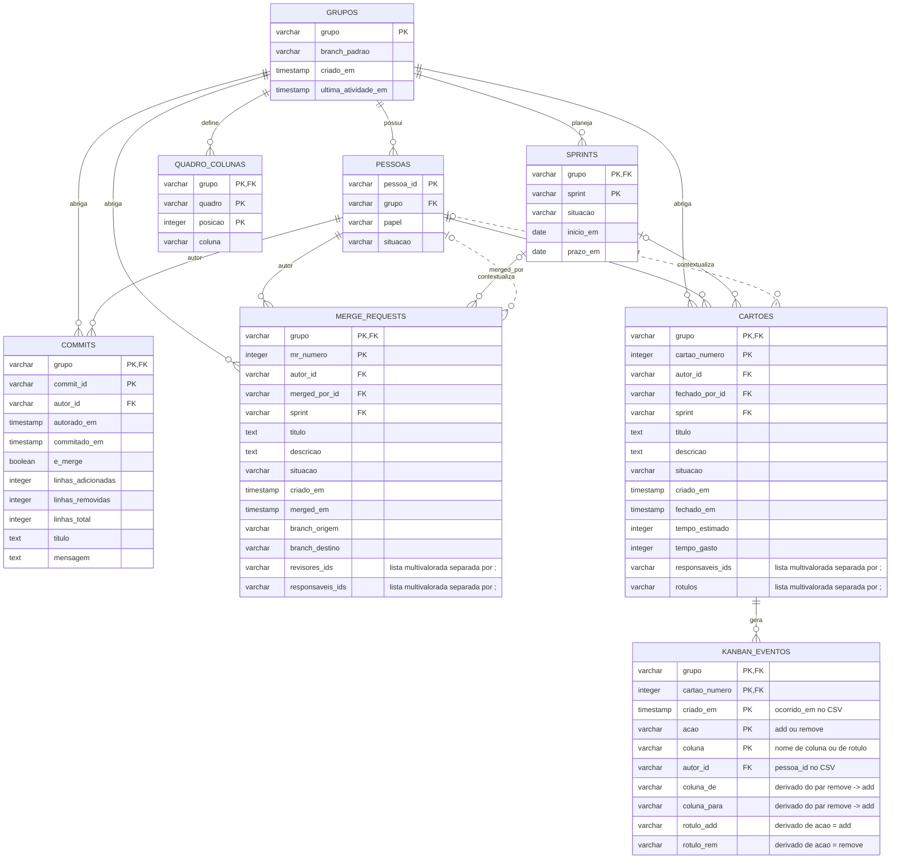
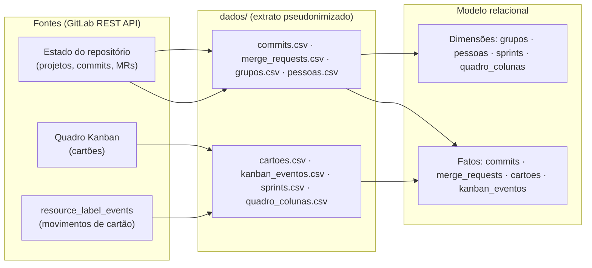
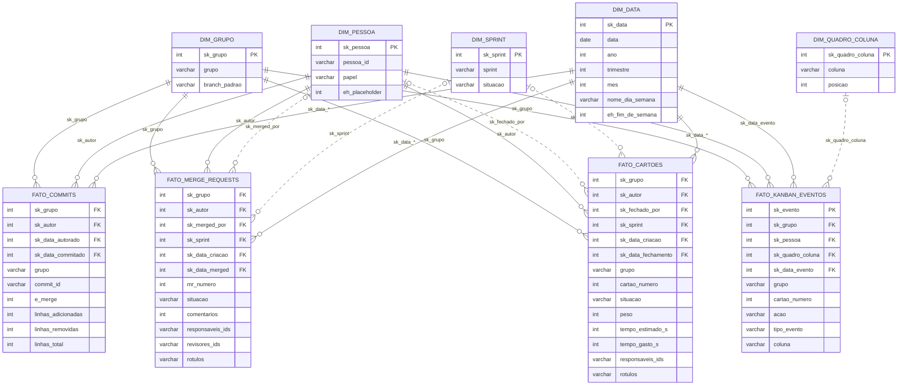

# Modelagem Lógica de Dados (Relacional)

> **Projeto do Módulo PBL — Repositório GitLab & Quadro Kanban**
> Instituto Ápice · Turma T28 · Ciclo 2026-1b · Extraído em 2026-08-29
> Diagrama de referência: [`modelagem_logica.png`](./modelagem_logica.png)

---

## 1. Visão geral

O conjunto de dados registra o **rastro de trabalho de grupos PBL** em dois canais complementares:

1. **Repositório GitLab** (canal de estado, via API REST): `commits` e `merge_requests` de cada grupo;
2. **Quadro Kanban** (movimentação de cartões, via `resource_label_events`): `cartoes` e o log de eventos `kanban_eventos`.

O escopo é **multi-grupo** (G01–G03): toda entidade carrega `grupo` como parte da chave primária, e os IDs de pessoas são prefixados pelo grupo (ex.: `G01-A13`). Os dados reais foram **pseudonimizados** — autores não-membros aparecem como placeholders `[bot]` e `[externo]`.

| Arquivo | Entidade | Registros | Papel |
|---|---|---:|---|
| `grupos.csv` | `grupos` | 3 | Dimensão — grupo PBL |
| `pessoas.csv` | `pessoas` | 83 | Dimensão — membros (owner 6, maintainer 64, reporter 12, guest 1) |
| `sprints.csv` | `sprints` | 15 | Dimensão — iterações do ciclo |
| `quadro_colunas.csv` | `quadro_colunas` | 12 | Dimensão — configuração do quadro (colunas por posição) |
| `commits.csv` | `commits` | 2.688 | Fato — atividade de versionamento |
| `merge_requests.csv` | `merge_requests` | 540 | Fato — atividade de integração |
| `cartoes.csv` | `cartoes` | 1.238 | Fato — itens de trabalho do Kanban |
| `kanban_eventos.csv` | `kanban_eventos` | 13.194 | Fato — event log do quadro (add 8.445 / remove 4.749) |

---

## 2. Diagrama entidade-relacionamento

> As relações tracejadas (`merged_por`, `fechado_por`) não aparecem como linhas no diagrama original — lá são representadas apenas pelas FKs correspondentes. Cardinalidades `0..1` indicam FKs anuláveis (cartões/MRs podem não estar vinculados a uma sprint).
>
> **Ajuste pós-validação em `kanban_eventos`** — a PK `(grupo, cartao_numero, criado_em)` do PNG **não é única** nos dados: eventos de rótulos diferentes chegam no mesmo instante para o mesmo cartão (4.521 chaves repetidas). A chave real precisa de `acao` + `coluna`; restam 24 linhas redundantes em 12 eventos triplicados (todos com `coluna` vazia) — a carga dimensional deduplica para 13.170 eventos únicos (§7 e §8).

---

## 3. Entidades e papéis

| Entidade | Granularidade (1 linha =) | Chave primária | Chaves estrangeiras |
|---|---|---|---|
| `grupos` | 1 grupo PBL | `grupo` | — |
| `pessoas` | 1 membro de grupo | `pessoa_id` | `grupo` → grupos |
| `sprints` | 1 iteração do grupo | (`grupo`, `sprint`) | `grupo` → grupos |
| `quadro_colunas` | 1 coluna do quadro (posição) | (`grupo`, `quadro`, `posicao`) | `grupo` → grupos |
| `commits` | 1 commit | (`grupo`, `commit_id`) | `grupo`; `autor_id` → pessoas |
| `merge_requests` | 1 merge request | (`grupo`, `mr_numero`) | `grupo`; `autor_id`, `merged_por_id` → pessoas; `sprint` → sprints |
| `cartoes` | 1 cartão do Kanban | (`grupo`, `cartao_numero`) | `grupo`; `autor_id`, `fechado_por_id` → pessoas; `sprint` → sprints |
| `kanban_eventos` | 1 evento do quadro | (`grupo`, `cartao_numero`, `criado_em`, `acao`, `coluna`) † | (`grupo`, `cartao_numero`) → cartoes; `autor_id` → pessoas; `grupo` → grupos |

† A PK do PNG (`grupo`, `cartao_numero`, `criado_em`) tem 4.521 chaves repetidas nos dados; acrescentando `acao` + `coluna` restam 24 linhas redundantes (12 eventos triplicados). Log de eventos sem chave natural garantida → surrogate na carga (`sk_evento`, §8).

**Dimensões** (contexto): `grupos`, `pessoas`, `sprints`, `quadro_colunas`.
**Fatos** (atividade): `commits`, `merge_requests`, `cartoes`, `kanban_eventos`.

---

## 4. Relacionamentos e cardinalidades

| Relação | Cardinalidade | FK implementada | Observação |
|---|---|---|---|
| grupos → pessoas | 1 : N | `pessoas.grupo` | Todo membro pertence a exatamente 1 grupo |
| grupos → sprints | 1 : N | `sprints.grupo` | Sprint é identificada dentro do grupo |
| grupos → quadro_colunas | 1 : N | `quadro_colunas.grupo` | Cada grupo tem seu quadro/colunas |
| grupos → commits / merge_requests / cartoes | 1 : N | `*.grupo` | Escopo de todos os fatos |
| pessoas → commits | 1 : N (autor) | `commits.autor_id` | Aceita placeholders `[bot]` |
| pessoas → merge_requests | 1 : N (autor) | `merge_requests.autor_id` | Aceita placeholder `[externo]` |
| pessoas → merge_requests | 0..1 : N (merged_por) | `merge_requests.merged_por_id` | FK anulável |
| pessoas → cartoes | 1 : N (autor) | `cartoes.autor_id` | |
| pessoas → cartoes | 0..1 : N (fechado_por) | `cartoes.fechado_por_id` | FK anulável (cartões abertos) |
| sprints → merge_requests | 0..1 : 0..1:N | `merge_requests.sprint` | MR pode não estar alocado a sprint |
| sprints → cartoes | 0..1 : 0..1:N | `cartoes.sprint` | Cartão pode não estar alocado a sprint |
| cartoes → kanban_eventos | 1 : N | (`grupo`, `cartao_numero`) | Todo evento referencia exatamente 1 cartão (0 órfãos); 1.235/1.238 cartões têm eventos (mín. 2, máx. 25), 3 cartões sem evento |

---

## 5. Observações de modelagem

1. **Escopo por grupo (chave composta)** — toda PK inclui `grupo`, tornando o modelo particionável por grupo PBL sem risco de colisão de IDs (ex.: `commit_id` e `mr_numero` são únicos *por grupo*).
2. **Atributos multivalorados** — `responsaveis_ids`, `revisores_ids` e `rotulos` armazenam listas separadas por `;` (ex.: `ART.01;BUG;DOCUMENTATION`). É uma denormalização deliberada do extrator (1FN violada); para análise, explode em linhas.
3. **Event sourcing em `kanban_eventos`** — o diagrama representa a visão derivada (`coluna_de`/`coluna_para` para movimentação; `rotulo_add`/`rotulo_rem` para rótulos). O CSV bruto armazena o evento atômico: `acao` (`add`/`remove`) + `coluna` (nome de coluna **ou** de rótulo) + `pessoa_id` + `ocorrido_em`. Nos 13.194 eventos: 9.052 são de colunas do quadro (todas as 4 colunas de `quadro_colunas` aparecem), 4.106 de rótulos (77 valores distintos) e 36 são `add` com `coluna` vazia — 12 eventos únicos, cada um triplicado no extrato (os 24 redundantes são removidos na carga dimensional, §8). O histórico dos eventos é maior que o estado atual: 22 eventos referem rótulos que não estão mais em `cartoes.rotulos` (ex.: `P4`, `GG`, `Ano: 2025`) — `rotulos` guarda só o estado final.
4. **Integridade referencial parcial** — as FKs de autor aceitam placeholders que **não existem** em `pessoas`: `[bot]` (161 commits, ex.: commit inicial) e `[externo]` (851 ocorrências: 391 em `commits.autor_id`, 24 em `cartoes.autor_id`, 42 em `cartoes.fechado_por_id`, 22 em `merge_requests.autor_id`, 22 em `merged_por_id`, 350 em `kanban_eventos.pessoa_id`). Tratar como "ator não cadastrado" nas análises.
5. **Medidas em `cartoes`** — `tempo_estimado` e `tempo_gasto` são armazenados em segundos (`tempo_estimado_s` / `tempo_gasto_s` nos CSVs).
6. **Colunas nos CSVs não exibidas no diagrama** — acréscimos do extrator:
   - `cartoes`: `atualizado_em`, `prazo_em`, `peso`, `comentarios`;
   - `merge_requests`: `atualizado_em`, `fechado_em`, `e_rascunho`, `comentarios`, `rotulos`;
   - `commits`, `grupos`, `pessoas`, `sprints`, `quadro_colunas`: alinhados 1:1 ao diagrama.
7. **Pares de colunas do diagrama** — o PNG agrupa campos relacionados em uma linha (`criado_em / merged_em`, `branch_origem / destino`); aqui foram decompostos em atributos individuais para casar com os CSVs.
8. **Referências entre grupos** — 9 fatos citam pessoas de outro grupo (6 commits e 3 MRs de membros de G03 em repositórios G01/G02). A FK de autor é **global** (`pessoas.pessoa_id`), não escopada por grupo — todas as pessoas citadas existem em `pessoas.csv`. Obs.: o mesmo `commit_id` (`1f8bf681`, `03172236`) aparece em G01 e G02 — a PK composta com `grupo` evita a colisão.
9. **CSVs com campos multilinha** — `titulo`/`descricao` contêm quebras de linha dentro de aspas; o número de linhas físicas excede o de registros (ex.: `cartoes.csv`: 6.669 linhas / 1.238 registros). Use parser CSV que respeite aspas — não leia o arquivo linha a linha.

---

## 6. Pipeline de origem dos dados

Recorte do manifesto: repositórios `graduacao/<ciclo>/<turma>/<grupo>`; sem diff por commit e sem comentários de issue/MR.

---

## 7. Validação cruzada (modelo × dados)

Verificação sistemática do modelo contra os CSVs — unicidade, FKs, cardinalidades, domínios e semântica — via PowerShell (`Import-Csv`).

| # | Verificação | Resultado | Evidência |
|---|---|---|---|
| 1 | Volumes por arquivo = `manifesto.json` | ✅ 8/8 | commits 2.688 · MRs 540 · cartões 1.238 · eventos 13.194 · pessoas 83 · sprints 15 · colunas 12 · grupos 3 |
| 2 | Unicidade das PKs | ✅ 7/8 | `grupos`, `pessoas`, `sprints`, `quadro_colunas`, `commits`, `merge_requests`, `cartoes` únicas |
| 2a | PK de `kanban_eventos` (como no PNG) | ❌ corrigida | `(grupo, cartao, criado_em)`: 4.521 chaves repetidas; com `acao`+`coluna`: 24 linhas redundantes em 12 eventos triplicados → dedupe na carga dimensional (§8) |
| 3 | FKs → `grupos` (7 tabelas) | ✅ 0 inválidos | — |
| 4 | FKs → `pessoas`, `sprints`, `cartoes` | ✅ 0 inválidos | além dos placeholders documentados (obs. 4) |
| 5 | Sprint FK anulável (0..1) | ✅ | 98/540 MRs e 64/1.238 cartões sem sprint; toda sprint citada existe, por grupo |
| 6 | Prefixo do ID = grupo da linha | ⚠️ 9 exceções legítimas | 6 commits + 3 MRs de membros de G03 em G01/G02, pessoas cadastradas (obs. 8) |
| 7 | Domínios de valor | ✅ | `e_merge`/`e_rascunho` {0,1}; MR `situacao` {opened 1, merged 500, closed 39}; cartões {opened 64, closed 1.174}; `acao` {add, remove}; papéis {owner 6, maintainer 64, reporter 12, guest 1} |
| 8 | `linhas_total` = adicionar + remover | ✅ 2.688/2.688 | — |
| 9 | Separador `;` nos multivalorados | ✅ | nenhum `,` encontrado |
| 10 | Tipos de data/hora | ✅ | todos os `TIMESTAMP` em ISO válido; `sprints.inicio_em`/`prazo_em` são `DATE` `YYYY-MM-DD` (preenchidos em 5/15 sprints) |
| 11 | `kanban_eventos` → `cartoes` | ✅ 0 órfãos | 1.235 cartões com eventos (min 2, max 25); 3 cartões sem evento |
| 12 | Derivação `coluna_de`/`coluna_para` | ✅ | todo movimento de coluna começa com `add`; 14 sequências ambíguas por timestamp idêntico (ordem interna do par indeterminada) |
| 13 | Rótulos dos eventos ⊆ rótulos atuais | ⚠️ 22 eventos | histórico > estado atual: `P4` ×12, `GG`, `SIZE G`, `Ano: 2025`, `Curso: Eng. Computação`, `Trimestre: B` (obs. 3) |
| 14 | Consistência de estado | ✅ | `closed` ⇔ `fechado_em`/`fechado_por_id` preenchidos (64 abertos = 64 vazios); `merged` ⇔ `merged_em`/`merged_por_id` (500 MRs merged, 0 sem `merged_por_id`); `criado_em` ≤ `fechado_em`/`merged_em` em 100% |
| 15 | Colunas CSV = modelo (+ extras) | ✅ | divergências são apenas os acréscimos listados na obs. 6 |

**Correções aplicadas após a validação**: PK de `kanban_eventos` redefinida com `acao` + `coluna` (§2 e §3, com nota de surrogate); observações 3 e 4 reescritas com números medidos; observações 8 e 9 adicionadas.

---

## 8. Modelo dimensional (OLAP) — `relacional/csv`

Star schema gerado a partir de `dados/` para uso analítico (decisões: **surrogate keys inteiros**, multivalorados **mantidos como listas `;`** nas fatos, **dim_data** de calendário, **fatos apenas transacionais** — sem snapshot periódico). Arquivos em `relacional/csv/`, UTF-8, cabeçalho na 1ª linha.

### 8.1 Inventário de arquivos

| Arquivo | Papel | Granularidade (1 linha =) | Registros |
|---|---|---|---:|
| `dim_grupo.csv` | Dimensão | 1 grupo PBL | 4 (3 + N/A) |
| `dim_pessoa.csv` | Dimensão | 1 pessoa (inclui `[bot]` e `[externo]`) | 85 (83 + 2 placeholders) |
| `dim_sprint.csv` | Dimensão | 1 sprint | 16 (15 + N/A) |
| `dim_quadro_coluna.csv` | Dimensão | 1 coluna do quadro | 13 (12 + N/A) |
| `dim_data.csv` | Dimensão | 1 dia do calendário (2022-01-01 a 2026-12-31) | 1.827 (1.826 + N/A) |
| `fato_commits.csv` | Fato transacional | 1 commit | 2.688 |
| `fato_merge_requests.csv` | Fato transacional | 1 merge request | 540 |
| `fato_cartoes.csv` | Fato transacional (acumulativo) | 1 cartão (estado atual) | 1.238 |
| `fato_kanban_eventos.csv` | Fato transacional | 1 evento único do quadro | 13.170 (dedup de 13.194) |

### 8.2 Convenções

- **Chaves substitutas (`sk_*`)** inteiras, atribuídas em ordem de chave natural; `sk = -1` significa **N/A** (ex.: `sk_sprint = -1` → cartão sem sprint; `sk_data_merged = -1` → MR não mesclado). Cada dimensão tem linha `(N/A)` correspondente.
- **Dimensões degeneradas** preservadas nas fatos (`grupo`, `commit_id`, `mr_numero`, `cartao_numero`) para rastreio direto ao extrato.
- **Papel das datas**: `sk_data_autorado`, `sk_data_commitado`, `sk_data_criacao`, `sk_data_atualizacao`, `sk_data_merged`, `sk_data_fechamento`, `sk_data_prazo` e `sk_data_evento` apontam para `dim_data` (`sk_data` = `AAAAMMDD`); os timestamps originais permanecem nas fatos.
- **Placeholders como membros**: `dim_pessoa` inclui `[bot]` (sk 84) e `[externo]` (sk 85) com `eh_placeholder = 1` — FKs nunca apontam para fora da dimensão.
- **Multivalorados** (`responsaveis_ids`, `revisores_ids`, `rotulos`) preservados como listas separadas por `;` (decisão do usuário); explodir na consulta quando necessário.
- **`fato_kanban_eventos`**: dedupe das 24 linhas redundantes (12 eventos `add` com `coluna` vazia triplicados) → 13.170 linhas com `sk_evento` sequencial 1..13.170; `tipo_evento` classifica o evento: `coluna` (9.052, `sk_quadro_coluna` resolvido), `rotulo` (4.106, `sk_quadro_coluna = -1`), `vazio` (12, `coluna` vazia no extrato).
- **Medidas originais mantidas**: `linhas_*`, `comentarios`, `tempo_*_s` (segundos), `peso`; `e_merge`/`e_rascunho` como 0/1.
- 3 cartões não têm evento em `fato_kanban_eventos`; 64 cartões abertos têm `sk_fechado_por = -1` e `sk_data_fechamento = -1`.
- Campos `titulo`/`descricao` preservam quebras de linha dentro de aspas (leia com parser CSV padrão).